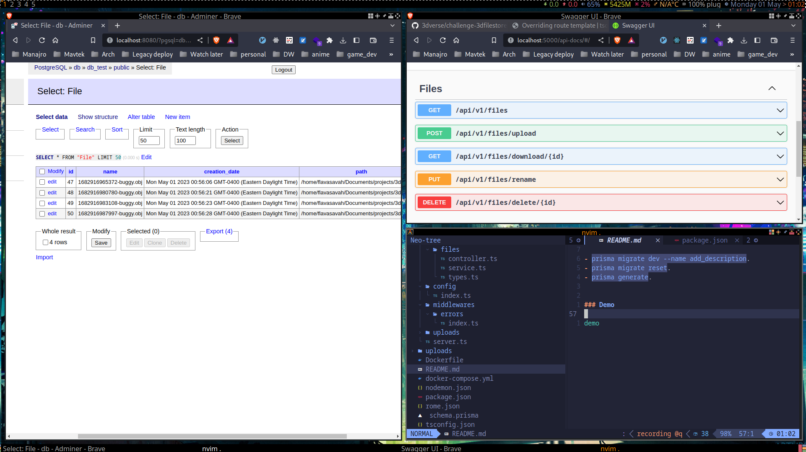

#### OBJ Wavefront files store:

- `Nodejs`
- `Express`
- `Typescript`
- `Tsoa`

#### Why `tsoa` and not a shiny framework like `nestjs`, Why using `postgres` ?

- `I am using TSOA package and postgres for my side project because I need to implement a file management features. This way, 
even if I don't pass the technical test, I can still make use of this functionality in my project.`

#### Routes

- `GET: /api/v1/files`
- `POST: /api/v1/files/upload`
- `GET: /api/v1/files/download/{id}`
- `PUT: /api/v1/files/rename`
- `Delete: /api/v1/files/delete/{id}`

#### Development:

- `yarn run dev`

### Nice to have:

- `Unit test` : I need more time.
- `Download a transformed file` : I need more time.
- `Test with the frontend`: I need more time.

### Routes and validations docs is using `tsoa`

- Swagger : `http://localhost:5000/api-docs`
- `yarn tsoa spec-and-routes`

### Database:

Database client  `Postgres` with (https://www.prisma.io/)

Under folder `database`:

- `docker-compose up -d`

Project root: 

- `yarn prisma generate`.
- `yarn prisma migrate dev`.

Update migration schema:

- `prisma migrate dev --name add_description`.
- `prisma migrate reset`.
- `prisma generate`.

### Demo

